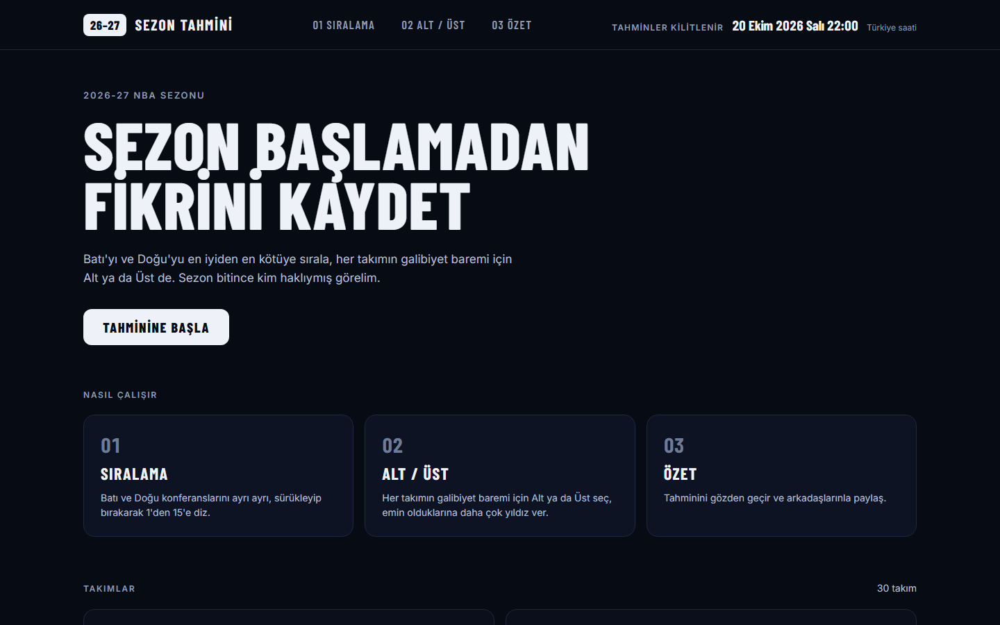
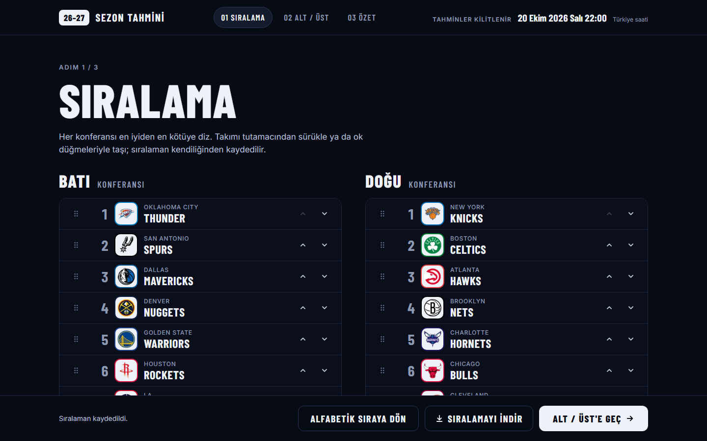
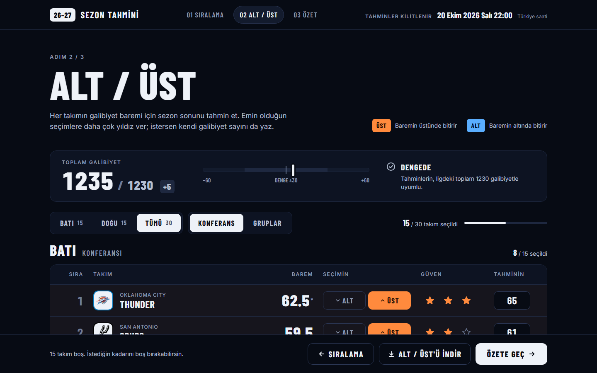
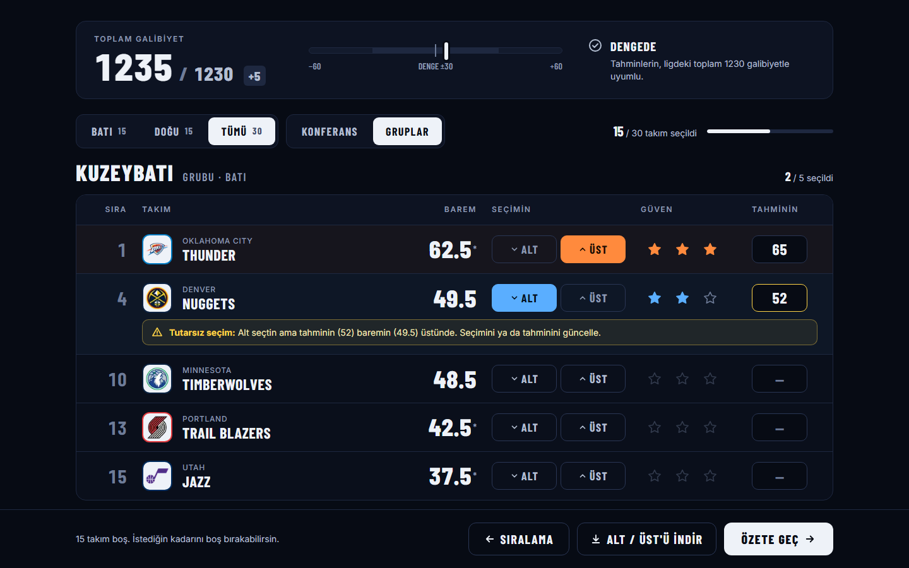
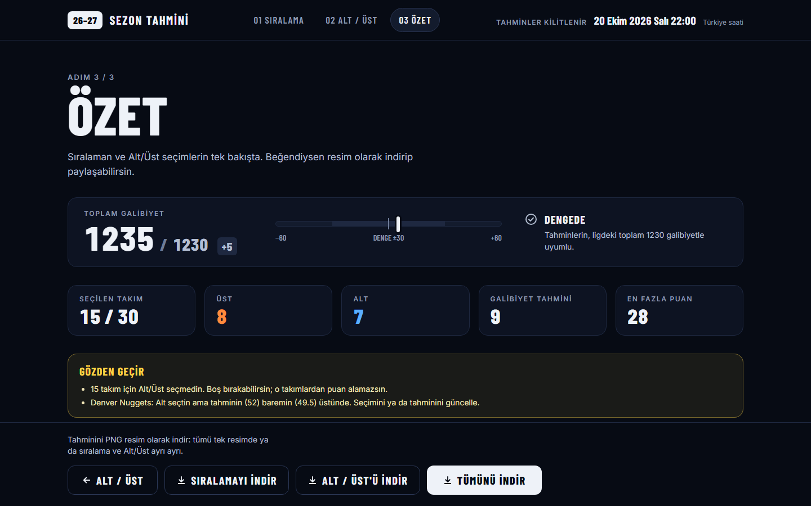
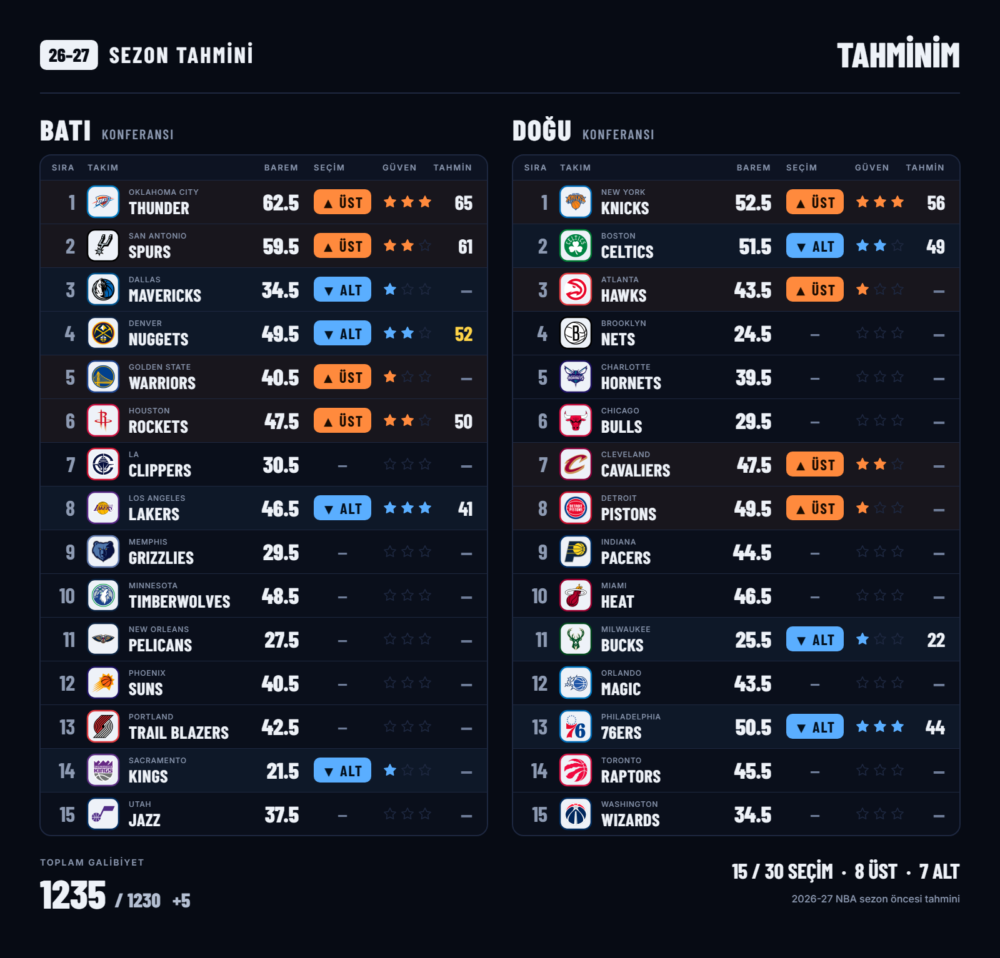

# NBA Sezon Öncesi Tahmin

**Sezon başlamadan fikrini kaydet, sezon bitince kim haklıymış görelim.**

2026-27 NBA sezonu için bir tahmin oyunu: Batı ve Doğu konferanslarını sırala, her takımın galibiyet baremine Alt ya da Üst de, tahminini resim olarak indirip paylaş.

> Bu bir bahis sitesi değildir. Gerçek para, ödül, oran ya da bahis sitelerine bağlantı içermez.



## Nasıl çalışır

### 1. Sıralama

Batı ve Doğu ayrı ayrı, en iyiden en kötüye 1–15 dizilir. Takımlar tutamacından sürüklenerek, ok düğmeleriyle ya da klavyeyle (Boşluk + ok tuşları) taşınabilir. Sıralama kendiliğinden kaydedilir.



### 2. Alt / Üst

Her takım için barem gösterilir. Takımın sezonu baremin altında mı üstünde mi bitireceğini seçer, seçimine 1–3 yıldız güven verirsin. İstersen kendi galibiyet tahminini (0–82) de yazabilirsin.

- **Toplam galibiyet göstergesi:** Ligde her sezon toplam 1230 galibiyet olur. Tahminlerinin toplamı bundan 30'dan fazla saparsa uyarı görürsün.
- **Tutarsız seçim uyarısı:** "Üst" deyip baremin altında bir galibiyet sayısı yazarsan (ya da tersi) satırın altında işaretlenir.
- Uyarılar engellemez; yalnızca haber verir.



Takımlar konferansa göre (15 + 15) ya da gruplara göre (6 divizyon × 5 takım) listelenebilir; seçim tarayıcıda hatırlanır.



### 3. Özet

Seçim sayıları, alınabilecek en fazla puan, gözden geçirilmesi gereken noktalar ve tüm tahminlerin tek sayfada.



### Resim olarak indir

Tahmin üç şekilde PNG olarak indirilebilir: yalnızca sıralama, yalnızca Alt/Üst ya da ikisi birlikte. Resim tarayıcıda üretilir; hiçbir veri sunucuya gönderilmez.



## Puanlama (sezon sonu)

| Bölüm       | Kural                                                                                          |
| ----------- | ---------------------------------------------------------------------------------------------- |
| Alt / Üst   | Doğru tahmin, verdiğin yıldız kadar puan (1–3). Yanlış ya da berabere 0.                       |
| Sıralama    | Her konferansta senin sıran ile gerçek sıra arasındaki farkların toplamı. Düşük olan daha iyi. |
| Projeksiyon | Galibiyet tahminlerinin ortalama mutlak hatası. Düşük olan daha iyi.                           |

Puanlama ve sezon içi takip henüz uygulanmadı (bkz. [Yol haritası](#yol-haritası)).

## Baremler

Baremler [BetMGM'in 2026-27 galibiyet baremi tablosundan](https://sports.betmgm.com/en/blog/nba/nba-odds-predictions-season-win-totals-bm23/) alınmıştır (23 Eylül 2026). Her takım için en az iki kaynak kayıtlıdır; kaynaklar arasında 1 galibiyetten fazla fark olan takımlar sitede `*` ile işaretlenir. Oranlar kaydedilmez ve gösterilmez.

- Veri: [`src/data/lines/2026-27.json`](src/data/lines/2026-27.json)
- Kaynaklar ve kontroller: [`docs/barem-raporu-2026-27.md`](docs/barem-raporu-2026-27.md)

Tahminler, sezonun ilk maçının başlama anında kilitlenir: **20 Ekim 2026 Salı 22:00** (Türkiye saati).

## Kurulum

Node.js 22 ile geliştirildi.

```bash
npm install
npm run dev        # http://localhost:3000
```

| Komut               | Ne yapar                                        |
| ------------------- | ----------------------------------------------- |
| `npm run dev`       | Geliştirme sunucusu                             |
| `npm run build`     | Production build                                |
| `npm run lint`      | ESLint + Prettier kontrolü                      |
| `npm run typecheck` | `tsc --noEmit`                                  |
| `npm run test`      | Vitest birim testleri (kapsam raporuyla)        |
| `npm run test:e2e`  | Playwright uçtan uca testleri (önce build alır) |

Uçtan uca testler için bir kez `npx playwright install chromium` çalıştırmak gerekir.

## Teknoloji

- **Next.js 16** (App Router) + **React 19** + **TypeScript** (`strict`)
- **Tailwind CSS 4**
- **@dnd-kit** — sürükle-bırak sıralama
- **Zod** — barem verisinin ve tarayıcıda saklanan tahminin doğrulanması
- **Vitest** ve **Playwright** — testler

Veritabanı ve kullanıcı hesabı yoktur; tahminler tarayıcının `localStorage` alanında tutulur.

## Proje yapısı

```
config/season.ts        sezon adı, kilit zamanı, lig sabitleri (1230 buradan türetilir)
src/app/                sayfalar: / · /siralama · /alt-ust · /ozet
src/components/         arayüz bileşenleri
src/lib/                saf iş mantığı (React'tan bağımsız, testli)
src/data/teams.ts       30 takım — tek kaynak
src/data/lines/         baremler (JSON)
src/i18n/tr.ts          tüm arayüz metinleri
public/logos/           takım logoları
tests/unit · tests/e2e  Vitest ve Playwright testleri
docs/                   tasarım sistemi, barem raporu, ekran görüntüleri
```

Projenin kapsamı ve sınırları [`ISKELET.md`](ISKELET.md), görsel sistem [`docs/TASARIM.md`](docs/TASARIM.md) içindedir.

## Yol haritası

- [x] **Faz 0** — kurulum, takım verisi, baremler, tasarım sistemi
- [ ] **Faz 1** — hesapsız sürüm. Sıralama, Alt/Üst, özet ve resim indirme hazır; paylaşım linki, sosyal medya önizleme kartı ve sıralama–projeksiyon tutarlılık uyarısı eksik
- [ ] **Faz 2** — e-posta ile giriş, tahminlerin sunucuda saklanması, kilidin sunucuda zorlanması
- [ ] **Faz 3** — sezon içi takip, puanlama, liderlik tablosu

## Yasal not

Bu site NBA veya herhangi bir takımla bağlantılı değildir. Takım adları ve logoları sahiplerinin tescilli markalarıdır ve yalnızca takımları tanıtmak amacıyla kullanılmıştır.
